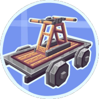

<div align="center">
  
  <h1>Create Steam 'n' Rails</h1>

[](https://discord.gg/create-steam-n-rails-706277846389227612)
</div>

**Create Steam 'n' Rails** is an addon mod for Create that aims to extend Create's train and steam systems. Current features include custom tracks, semaphores, and conductors.

## Contributing (for team members):
1. Create a new branch for your feature (named `1.19/<feat>`)
2. Write your feature
3. Make a pull request
4. Have somebody review it, and merge

## Contributing (for community members):
1. Open an issue clearly describing the feature you want to implement
2. Don't start writing your feature until a core dev recommends you to
3. Fork the repository (if you haven't already), and make a branch for your feature
4. Happy coding!
5. Open a pull request, preferably linking to your issue - include your Discord username, and those of the people who helped you, so you can get the contributor role
6. (For core devs) at least 2 core devs should approve before merging - probably have discussion in Discord first as well.

### Datagen:
Make sure to set the following environment variable when running datagen.
```env
DATAGEN=TRUE
```

### Commit Tricks:

- Include `[ci skip]` in your commit message to skip the automatic preview build
you can use this for example if the change you made is very minor, and not worth
a preview, or if you are just fixing a typo in the README, etc.


## License
Steam 'n' Rails is licensed under the LGPL license. See [LICENSE](LICENSE) for more information.

Certain sections of the code are from the Create mod, which is licensed under the MIT license. See [Create's license](https://github.com/Creators-of-Create/Create/blob/mc1.18/dev/LICENSE) for more information.

Some datafixer code is from the Quilt Standard Libraries, which is licensed under the Apache-2.0 license. See [QSL's license](https://github.com/QuiltMC/quilt-standard-libraries/blob/1.19.4/LICENSE) for more information.

Most of the code for spy conductors is from Security Craft, which is licensed under the MIT license. See [Security Craft's license](https://github.com/Geforce132/SecurityCraft/blob/1.18.2/LICENSE) for more information.

Most of the code for annotation based conditional mixins is from Neruina, which is licensed under the MIT license. See [Neruina's license](https://github.com/Bawnorton/Neruina/blob/multi-version/LICENSE.txt) for more information.

Most of the code for the sloped/custom hitbox outlines is from FramedBlocks, which is licensed under the LGPL license. See [FramedBlock's license](https://github.com/XFactHD/FramedBlocks/blob/17c8274ca380c3a868763b1b05657d07860c364b/LICENSE) for more information.